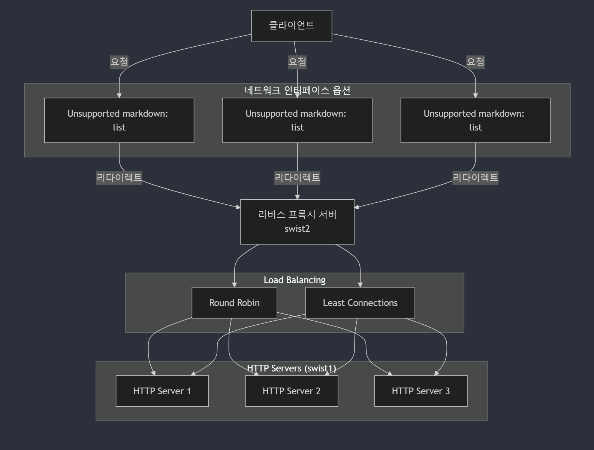

## 💻 프로젝트 개요

### 주요 기능

1. 기본적인 HTTP 요청, 응답 처리
   - GET 요청에 대해서 클라이언트의 입력에 따른 document를 반환
2. HTTP 메소드 구분
   - 단, content-type은 JSON, html, image만 지원
3. 로드밸런서 (RR, LC), 리버스 프록시
4. 서버 헬스 체크

### 특장점

1. epoll 기반의 이벤트 처리
2. 스레드 풀 사용
3. 리버스 프록시 및 로드밸런싱
   - RR : RoundRobin 방식으로 단순하게 모든 서버에 균등하게 요청을 분배함. 모든 서버의 성능이 같은 swist 서버 환경의 특성상 적합하다고 판단
   - LC : 실시간 서버 부하 상태를 반영하여 효율적으로 부하를 분산하지만 구현이 복잡함
4. 주기적인 서버 모니터링

## 💡 프로젝트 평가

### **Siege**

##### [Why Seige?](./test.md)

#### 주요 테스트 항목

- Transactions : 클라이언트가 서버로 전송한 HTTP 요청 중 처리된 요청 수
- Availability : 서버가 성공적으로 요청을 처리한 비율
- Throughput : 단위 시간당 처리된 데이터 전송량
- Concurrency : 테스트 동안 평균적으로 동시에 연결된 클라이언트 수

##### [test results](https://github.com/NginxXServer/.github/tree/main/test_results)

## 🗂️ System Architecture

[인터페이스 설계](./interface.md)

## 📜 Development History

### Version 1

- HTTP 서버, 리버스 프록시 서버, 클라이언트를 개발 및 통합 테스트 진행

- [v1 개발 과정 보기](../v1/version1.md)

### Version 2

- 분산형 HTTP 서버, 서버 헬스체크, RR을 이용한 로드밸런싱 개발 및 통합 테스트 진행

- [v2 개발 과정 보기](../v2/version2.md)

### Version 2.1

- 리버스 프록시 구조 변경 (싱글 스레드 -> 멀티 스레드), HTTP 서버가 지원하는 content type 변경 (json만 지원 -> 이미지, html 지원)

- [v2.1 개발 과정 보기](../v2.1/READEME.md)

### Version 3

- LC를 이용한 로드밸런싱 추가 및 epoll 기반의 비동기 통신 사용

- [v3 개발 과정 보기](../v3/READEME.md)

### Version 4

- HTTP, 리버스 프록시 서버에 스레드 풀 적용

- [v4 개발 과정 보기](../v4/READEME.md)

## Versions 비교

| 항목                 | v2                   | v3                                    | v4                      |
| -------------------- | -------------------- | ------------------------------------- | ----------------------- |
| **이벤트 처리 방식** | 없음 (순차처리)      | Edge Trigger (ET) + Level Trigger(LT) | Level Trigger (LT)      |
| **소켓 모드**        | Blocking             | Non-blocking + blocking               | Non-blocking + blocking |
| **병렬 처리**        | 없음 (단일 프로세스) | epoll로 다중 처리                     | Thread Pool 사용        |
| **accept 처리**      | Blocking             | Non-blocking (while 루프로 모두 처리) | Blocking (한번에 하나)  |
| **I/O 처리**         | 동기 (Blocking)      | 비동기 (Non-blocking)                 | 동기 (Thread Pool에서)  |
| **동시성**           | 단일 스레드          | 이벤트 기반                           | 이벤트 + Thread Pool    |

 

## 🔗 Repository

- [HTTP Server](https://github.com/NginxXServer/NginxX-HttpServer)
- [Reverse Proxy Server](https://github.com/NginxXServer/NginxX-ProxyServer)
- [Client](https://github.com/NginxXServer/NginxX-Client)

## Quick Start

- [Quick Start](./quickStart.md)
