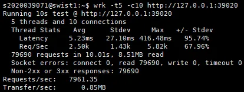

아래와 같은 이유로 처음에는 **wrk** 사용을 계획하였다.

- 다른 웹 서버 벤치마크에 비해 가벼우면서도 마이크로초 단위의 정밀한 타이밍 측정이 가능하고 통계 데이터, 상세한 에러 리포팅을 제공

- wrk를 통한 Throughput, 응답 시간, 에러율, 동시 사용자 수 평가

- 정적 부하 테스트, 최대 부하 테스트, 스파이크 테스트 진행

하지만 wrk는 기본적으로 Keep-Alive를 사용하면서 다음과 같은 과정을 거친다.

1. wrk가 요청을 보냄
2. 서버가 응답을 보내고 연결을 닫음
3. wrk는 같은 연결이 살아있다고 생각하고 다시 요청을 보냄
4. 하지만 연결은 이미 닫혔으므로 read error 발생

따라서 socket errors: read가 굉장히 발생한다는 문제가 있었다.

 
 
다음으로 keep alive를 사용하는 wrk 보다, 각 연결에 대해 더 명확한 생명주기를 관리하고 기본적으로 연결을 재사용하지 않는 ab가 우리 프로젝트에 좀 더 잘 맞는 테스트 도구이기에 테스트 도구를 ab로 변경하였다.
 

ab의 경우 다음의 요구사항을 만족한다.

1. 동기적 요청
2. Keep alive를 사용하지 않음

하지만 요청 url을 랜덤하게 설정하는 기능은 제공하지 않아서 다른 툴을 찾아보았고 우리 프로젝트의 특성상 siege를 사용하기로 최종 결정하였다.
