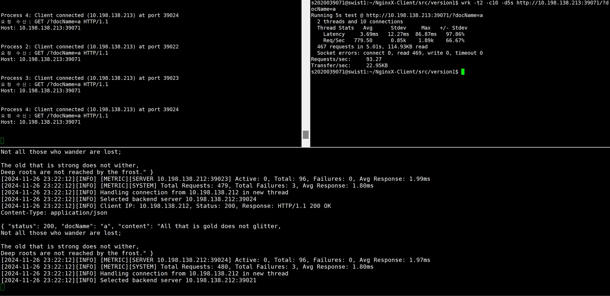

# 김지유

### HTTP 서버가 지원하는 content type 변경

현재 JSON만 지원하는 구조에서 html, image 타입 또한 지원하도록 변경

# 조준화

### 리버스 프록시 구조 변경

현재 구조는

```c
while (1) {
    int client_socket = accept(listen_socket, (struct sockaddr*)&client_addr, &client_addr_len);

    close(client_socket);
    close(target_socket);
}
```

위의 방식대로 한 클라이언트의 요청을 완전히 처리할 때까지 다음 클라이언트의 연결을 받지 않는다.

따라서 epoll을 사용한 비동기 방식으로 처리하거나 pthread를 사용하여 멀티 스레드 방식을 적용해야 한다.

이번 버전에서는 멀티 스레드를 적용하기로 결정하였다.

- 부모스레드는 계속해서 `accept()`를 통해 새로운 연결을 받음
- 새로운 연결이 들어올 때마다 작업을 처리할 새로운 자식 스레드를 생성
- 자식 스레드는 독립적으로 백엔드 서버와의 통신을 처리

그리고 동기화 문제를 해결하기 위해 mutex를 적용해야 할 부분을 생각해보았다.

1. `select_server` 함수에서 `current_server` 전역 변수에 접근하는 부분

   ```python
   int select_server() {
       int selected = -1;

       // current_server 접근 시에만 짧게 뮤텍스 사용
       pthread_mutex_lock(&server_select_mutex);
       int start_idx = current_server;
       current_server = (current_server + 1) % MAX_BACKENDS;
       pthread_mutex_unlock(&server_select_mutex);

       // 서버 검색은 뮤텍스 없이 수행...
   }
   ```

2. 전체 서버의 상태를 관리하는 부분

   ```python
   pthread_mutex_lock(&pool->pool_mutex);
   pool->total_requests++;
   pool->total_failures++;
   pool->avg_response_time = ...
   pthread_mutex_unlock(&pool->pool_mutex);
   ```

3. 각 서버의 상태를 관리하는 부분

   ```python
   pthread_mutex_lock(&server->server_mutex);
   server->current_requests++;
   server->is_healthy = true;
   server->failed_responses = 0;
   pthread_mutex_unlock(&server->server_mutex);
   ```

<br>
<br>


